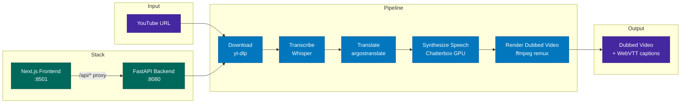

# Foreign Whispers
[](./LICENSE)

YouTube video dubbing pipeline — transcribe, translate, and dub 60 Minutes interviews into a target language.

---
Project was completed by Bryan Wang and Maiya Duran

Link to videos:
https://drive.google.com/drive/folders/1VbOlLp8TH6GDzoHS6DE4EMuLCmWA91kL
## Implementation Status

All core pipeline stages and assigned notebook tasks have been completed.
TLDR: we followed the steps on the project description website and implemented this notebook by notebook. Read known issues for more information.

### Download Integration
- `POST /api/download` accepts a YouTube URL, downloads the MP4 and captions via yt-dlp.
- **Optimization:** Added a fast-path cache check that extracts the video ID from the URL with a regex and skips the yt-dlp network call entirely when both the video file and caption file already exist on disk. This reduced the download stage from 200+ seconds to under 1 second for cached videos.

### Transcription Integration
- `POST /api/transcribe/{id}` runs Whisper (`faster-whisper-medium`) via the GPU STT container.
- Results are cached as JSON; re-runs return immediately with `skipped: true`.

### Diarization Integration (Tasks 1–5)
- **Task 1:** `diarize_audio()` implemented in `foreign_whispers/diarization.py` using `pyannote/speaker-diarization-3.1`.
- **Task 2:** `assign_speakers()` merges pyannote intervals into Whisper segments by maximum temporal overlap.
- **Task 3:** `POST /api/diarize/{video_id}` endpoint with result caching and automatic transcription label injection.
- **Task 4:** Diarize stage wired into the frontend pipeline UI.
- **Task 5:** Per-speaker TTS voice selection — each diarized speaker is assigned a unique reference WAV.
- **Performance fix:** The ffmpeg audio extraction and pyannote inference are now run inside `asyncio.to_thread()`, preventing the blocking calls from freezing the FastAPI event loop and causing proxy timeouts on long-form videos (53+ minutes).

### Translation Integration
- `POST /api/translate/{id}` translates all segments from English → Spanish offline using argostranslate.
- Reranking selects among N translation candidates to minimize duration mismatch.

### Alignment Integration
- `global_align()` assigns a stretch action to each segment: `ACCEPT`, `MILD_STRETCH`, `REQUEST_SHORTER`, or `FAIL`.
- Duration estimation uses a **simple linear regression model** trained on empirical TTS output data:
  ```
  estimated_duration = 0.2083 × syllables + 0.6502
  ```
  This model outperforms the naive syllable-rate heuristic (`syllables / 4.5`) because it accounts for the fixed per-utterance overhead (breath, TTS startup latency), producing a non-zero intercept that avoids systematic under-prediction on short segments.
- Reranking (`reranking.py`) selects the translation candidate whose estimated duration most closely fits the target window, minimizing time-stretch.

### TTS Integration (Tasks 1–4)
- **Task 1:** Understood the existing Chatterbox client (`ChatterboxClient`) and its `speaker_wav` parameter.
- **Task 2:** Implemented `resolve_speaker_wav()` in `foreign_whispers/voice_resolution.py`. Uses a three-level resolution chain: `speakers/{lang}/{speaker_id}.wav` → `speakers/{lang}/default.wav` → `speakers/default.wav`.
- **Task 3:** Added `speaker_wav` query parameter to `POST /api/tts/{id}` and `speakers_dir` property to `Settings`.
- **Task 4:** Per-speaker voice assignment: the TTS endpoint reads speaker labels from the translated transcript, builds a `voice_map` via `resolve_speaker_wav`, and passes the correct reference WAV to Chatterbox for each segment.

### Stitch Integration
- `POST /api/stitch/{id}` remuxes the TTS WAV into the original MP4 using `ffmpeg -c:v copy`, replacing the audio track with zero re-encoding.

---

## Known Issues

We couldn't get the last video because diarization kept timing out due to the length of the video. We feel like we completed each step correctly though of the tasks.

pyannote / PyTorch Backward Compatibility
The most significant environment challenge encountered during development was a breaking incompatibility between pyannote.audio and newer versions of PyTorch introduced in PyTorch ≥ 2.6. It took us very long to fix this.

Starting in PyTorch 2.6, `torch.load()` defaults to `weights_only=True` as a security hardening measure. However, pyannote's checkpoint loading relies on serialized Python objects that are incompatible with `weights_only=True`, causing the pipeline load to fail immediately with a cryptic deserialization error. This was particularly difficult to diagnose because the error message did not clearly indicate the root cause.

This is applied in `foreign_whispers/diarization.py` and is necessary because the GPU containers ship with PyTorch ≥ 2.6 (required for CUDA compatibility with our hardware), and downgrading PyTorch to a version that is compatible with unpatched pyannote would break GPU inference entirely. There is no clean upstream fix available — pyannote has not yet released a version that supports `weights_only=True`.

Audio Segments Cut Off / Gaps of Silence
When a translated Spanish segment is longer than the original English window, `tts_engine.py` caps time-stretching at 1.25× (`SPEED_MAX`). Any audio that still exceeds the window after maximum stretching is hard-truncated, causing words to be cut off mid-sentence. Segments where TTS entirely fails (API timeout, GPU OOM) are replaced with silence.

Root cause: The alignment stage's duration estimate occasionally under-predicts, causing the reranker to accept translations that are too long. The linear regression model mitigates this compared to the simple syllable-rate heuristic, but cannot fully compensate for sentences where Spanish is structurally much longer than the English equivalent.

Partial mitigation: The `global_align()` `GAP_SHIFT` action attempts to extend a segment's window into adjacent silence. However, `tts_engine.py` currently uses the original segment boundaries rather than the shifted schedule, so the full benefit of gap-shifting is not yet realized.

Diarization Timeout on Long Videos
For videos longer than ~30 minutes (e.g., Military Drones at 53 min), pyannote's diarization can take 10–20 minutes. Prior to the `asyncio.to_thread` fix, this would cause the frontend proxy to report an Internal Server Error even though processing was still ongoing. The fix ensures the server stays responsive, but the frontend has no progress indicator for long-running diarization — it shows "Running" until completion with no estimated time remaining.

TTS Tensor Shape Mismatch
Occasionally the Chatterbox TTS server throws:
```
stack expects each tensor to be equal size, but got [1, 22] at entry 0 and [1, 15] at entry 66
```
This is an internal model error triggered by certain input texts (very short or punctuation-heavy segments). The affected segment is silently replaced with silence. This is a limitation of the upstream Chatterbox model and cannot be fixed at the pipeline level.

Frontend Proxy Instability
The Next.js frontend proxy to the FastAPI backend (`host.docker.internal:8080`) occasionally drops connections with `ECONNRESET / socket hang up` errors. This appears to be a Docker networking intermittency rather than an application bug, and typically resolves on retry without any code changes.


---

## Architecture



## Quick Start

Two profiles are available via Docker Compose:

```bash
# NVIDIA GPU — Whisper + Chatterbox on dedicated GPU containers
docker compose --profile nvidia up -d

# CPU only — no GPU containers (STT/TTS must be provided externally)
docker compose --profile cpu up -d
```

Open **http://localhost:8501** in your browser.

## Pipeline Stages

| Stage | What it does | Output |
|-------|-------------|--------|
| **Download** | Fetch video + captions from YouTube via yt-dlp | `videos/`, `youtube_captions/` |
| **Transcribe** | Speech-to-text via Whisper | `transcriptions/whisper/` |
| **Translate** | Source → target language via argostranslate (offline, OpenNMT) | `translations/argos/` |
| **Synthesize Speech** | TTS via Chatterbox (GPU) or Coqui (CPU fallback), time-aligned to original segments | `tts_audio/chatterbox/` |
| **Render Dubbed Video** | Replace audio track via ffmpeg remux (no re-encoding) | `dubbed_videos/` |

Captions are served as WebVTT via the `<track>` element — no subtitle burn-in:

| Endpoint | Source | Output |
|----------|--------|--------|
| `GET /api/captions/{id}/original` | YouTube captions (generated on the fly) | — |
| `GET /api/captions/{id}` | Translated segments + YouTube timing offset | `dubbed_captions/*.vtt` |

## Project Structure

```
foreign-whispers/
├── api/src/                     # FastAPI backend (layered architecture)
│   ├── main.py                  # App factory + lazy model loading
│   ├── core/config.py           # Pydantic settings (FW_ env prefix)
│   ├── routers/                 # Thin route handlers
│   │   ├── download.py          # POST /api/download
│   │   ├── transcribe.py        # POST /api/transcribe/{id}
│   │   ├── translate.py         # POST /api/translate/{id}
│   │   ├── tts.py               # POST /api/tts/{id}
│   │   └── stitch.py            # POST /api/stitch/{id}, GET /api/video/*, /api/captions/*
│   ├── services/                # Business logic (HTTP-agnostic)
│   ├── schemas/                 # Pydantic request/response models
│   └── inference/               # ML model backend abstraction
├── frontend/                    # Next.js + shadcn/ui
│   ├── src/components/          # Pipeline tracker, video player, result panels
│   ├── src/hooks/use-pipeline.ts # State machine for pipeline orchestration
│   └── src/lib/api.ts           # API client
├── download_video.py            # yt-dlp wrapper
├── transcribe.py                # Whisper wrapper
├── translate_en_to_es.py        # argostranslate wrapper
├── tts_es.py                    # Chatterbox client + time-aligned TTS generation
├── translated_output.py         # ffmpeg audio remux + legacy subtitle compositing
├── pipeline_data/               # All intermediate and output files (volume-mounted)
│   └── api/
│       ├── videos/              # Downloaded source MP4s
│       ├── youtube_captions/    # Line-delimited JSON from yt-dlp
│       ├── transcriptions/
│       │   └── whisper/         # Whisper output JSON
│       ├── translations/
│       │   └── argos/           # argostranslate output JSON
│       ├── tts_audio/
│       │   └── chatterbox/       # TTS WAV files per config
│       ├── dubbed_captions/     # Target-language VTT
│       ├── dubbed_videos/       # Final dubbed MP4s per config
│       └── speakers/            # Reference voice clips
├── docker-compose.yml           # Profiles: nvidia, cpu, apple
├── Dockerfile                   # Multi-stage: cpu and gpu targets
└── docs/
    └── dubbing-alignment-design.md  # TTS temporal alignment literature survey + design
```

## API Endpoints

| Method | Endpoint | Description |
|--------|----------|-------------|
| POST | `/api/download` | Download YouTube video + captions |
| POST | `/api/transcribe/{id}` | Whisper speech-to-text |
| POST | `/api/translate/{id}` | Source → target language translation |
| POST | `/api/tts/{id}` | Time-aligned TTS synthesis |
| POST | `/api/stitch/{id}` | Audio remux (ffmpeg -c:v copy) |
| GET | `/api/video/{id}` | Stream dubbed video (range requests) |
| GET | `/api/video/{id}/original` | Stream original video (range requests) |
| GET | `/api/captions/{id}` | Translated WebVTT captions |
| GET | `/api/captions/{id}/original` | Original English WebVTT captions |
| GET | `/api/audio/{id}` | TTS audio (WAV) |
| GET | `/healthz` | Health check |

## Development

### Container architecture

```
Host machine
├── foreign_whispers/      ← bind-mounted into API container
├── api/                   ← bind-mounted into API container
├── pipeline_data/api/     ← bind-mounted into API container
│
└── Docker Compose
    ├── foreign-whispers-stt   (GPU)  :8000  — Whisper inference
    ├── foreign-whispers-tts   (GPU)  :8020  — Chatterbox inference
    ├── foreign-whispers-api   (CPU)  :8080  — FastAPI orchestrator
    └── foreign-whispers-frontend      :8501  — Next.js UI
```

The API container is CPU-only — it delegates all GPU work to the STT and TTS
containers via HTTP. The `foreign_whispers/` library and `api/` source are
**bind-mounted** from the host, so edits on the host are immediately visible
inside the container.

### Editing and debugging the library

1. **Start all services:**

   ```bash
   docker compose --profile nvidia up -d
   ```

2. **Edit any file** in `foreign_whispers/` or `api/` on the host (e.g. in VS Code).

3. **Restart the API container** to pick up changes:

   ```bash
   docker compose --profile nvidia restart api
   ```

   To avoid manual restarts, add `--reload` to the uvicorn command in
   `docker-compose.yml`:

   ```yaml
   command: ["uv", "run", "uvicorn", "api.src.main:app", "--host", "0.0.0.0", "--port", "8080", "--reload"]
   ```

   With `--reload`, uvicorn watches for file changes and restarts automatically.

4. **Test via the SDK** from a notebook or Python REPL on the host:

   ```python
   from foreign_whispers import FWClient
   fw = FWClient()             # connects to http://localhost:8080
   fw.transcribe("GYQ5yGV_-Oc")
   ```

5. **Test the library directly** (no Docker needed for pure-Python alignment work):

   ```python
   from foreign_whispers import global_align, compute_segment_metrics, clip_evaluation_report
   ```

   This is the two-phase workflow:
   - **Phase 1 (SDK):** Call `FWClient` methods to drive the pipeline through Docker (download, transcribe, translate, TTS, stitch). Data lands in `pipeline_data/api/`.
   - **Phase 2 (library):** Import `foreign_whispers` directly to iterate on alignment algorithms using data produced in Phase 1. No GPU or Docker needed.

### Local setup (no Docker)

```bash
uv sync                    # install all dependencies
uv run python -c "from foreign_whispers import FWClient; print('ok')"
```

For Jupyter/VS Code notebooks, register the kernel once:

```bash
uv pip install ipykernel
uv run python -m ipykernel install --user --name foreign-whispers
```

Then select the **foreign-whispers** kernel in VS Code's kernel picker.

### When to rebuild

| Change | Action needed |
|--------|--------------|
| Edit `foreign_whispers/*.py` or `api/**/*.py` | Restart API container (or use `--reload`) |
| Edit `pyproject.toml` / add dependencies | `docker compose --profile nvidia build api && docker compose --profile nvidia up -d api` |
| Edit `frontend/` | Frontend has its own hot-reload; no action needed |
| Edit `docker-compose.yml` | `docker compose --profile nvidia up -d` (re-creates changed services) |

### File ownership

The API container runs as your host UID/GID (set in `.env`), so all files it
creates in `pipeline_data/` are owned by you — not root. If you see permission
errors on existing files, they were created by an older root-mode container:

```bash
sudo chown -R $(id -u):$(id -g) pipeline_data/
```

### Frontend

```bash
cd frontend && pnpm install && pnpm dev
```

### Requirements

- Python 3.11
- ffmpeg (system-wide)
- deno (for yt-dlp YouTube extraction)
- NVIDIA GPU recommended for Whisper + Chatterbox inference
